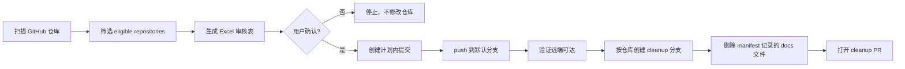

<h1 align="center">
  contributions-graph-filler-vp | 绿墙刷漆计划
</h1>

<p align="center">
  GitHub Contribution Graph 荒漠绿化治理工程
</p>

<p align="center">
  <a href="./LICENSE"></a>
  
  
  
</p>

<p align="center">
  简体中文
</p>

---

## 为什么要做

GitHub Contribution Graph 空荡荡？用它就对了，赛博植树造林计划。

<p align="center">
  
</p>

GitHub contribution graph 只会统计已经进入 GitHub 仓库、位于默认分支或 `gh-pages` 分支、并且作者邮箱能归属到账号的提交。只在本地 `git commit` 不会改变贡献图；提交后不 `push`，也不会被 GitHub 统计。

`contributions-graph-filler-vp` 把跨仓库维护操作拆成可审核、可执行、可追踪的流程。它不会隐式触发，也不会直接跳到提交，而是先生成 Excel 审核表，让用户确认日期、提交数、仓库分布和 commit 细则。

核心策略：

- **Excel-first**：任何执行前必须先生成 Excel 审核表，并等待用户明确确认。
- **existing-commit-aware**：先查询 GitHub 上同一天已有的作者提交数，再扣减计划新增数。
- **push-then-cleanup**：执行阶段必须先 `push` 到 GitHub 默认分支并验证远端可达，然后为每个仓库单独创建 cleanup PR 删除生成的 `docs/` 文件。

## 工作原理

1. 显式调用 `contributions-graph-filler-vp` 或 `$contributions-graph-filler-vp`。
2. 检查 `gh`、GitHub 登录状态和 API 连通性。
3. 扫描账号仓库，默认排除 fork 和 archived 仓库。
4. 要求 eligible repositories `> 10`。
5. 使用 activity profile 生成活跃日和每日目标提交数。
6. 查询当天已有作者提交数并扣减：

```python
planned_new_commit_count = max(0, target_commit_count - existing_author_commit_count)
```

7. 输出 Excel 审核表。
8. 用户确认后才允许执行。
9. 创建计划内提交，`push` 到默认分支并验证远端包含提交。
10. 每个受影响仓库单独创建 cleanup PR，删除本次生成的 `docs/` 文件。

## 执行流程



## 执行模式

| 模式 | 用途 | 修改仓库文件 | push 到 GitHub | 典型输出 |
| --- | --- | --- | --- | --- |
| `plan-only` | 只生成 Excel 审核计划 | 否 | 否 | Excel / TSV 审核表 |
| `push-and-cleanup-pr` | 用户确认后执行完整流程 | 是 | 是 | pushed commits、cleanup PR、manifest |
| `cleanup-pr` | 基于已有 manifest 只创建清理 PR | 是，只改 cleanup 分支 | 是，只 push cleanup 分支 | cleanup PR URL、删除文件统计 |

## 快速上手

生成每日聚合审核表：

```powershell
python .\scripts\generate_plan.py `
  --account VectorPeak `
  --start 2026-03-01 `
  --end 2026-04-01 `
  --profile vibe_coding_builder `
  --excel-out plan.xls
```

导出逐 commit 明细：

```powershell
python .\scripts\generate_plan.py `
  --account VectorPeak `
  --start 2026-03-01 `
  --end 2026-04-01 `
  --granularity commit `
  --excel-out commit-detail.xls `
  --out commit-detail.tsv
```

`--end` 使用左闭右开语义。如果要包含 `2026-03-31`，应传入 `--end 2026-04-01`。

## 输出格式

默认 Excel 审核表字段：

```text
日期 | 目标提交数 | 已有作者提交数 | 本次计划新增数 | commit 细则
```

逐 commit 明细字段：

```text
date | time | repo | kind | task_type | message | path | summary | target_commit_count | existing_commit_count | planned_new_commit_count
```

计划脚本只负责生成审核材料，不会 `commit`、`push` 或创建 cleanup PR。

Excel 审核表示例：

| 日期 | 目标提交数 | 已有作者提交数 | 本次计划新增数 | commit 细则 |
| --- | ---: | ---: | ---: | --- |
| 2026-03-05 | 4 | 1 | 3 | `21:10 KnowFoundry-RAG-Console docs: add retrieval notes`; `22:35 LLM-Wiki analysis: record validation split`; `23:18 OpenSense tests: document smoke test plan` |
| 2026-03-08 | 3 | 0 | 3 | `10:24 carbon-tower-predictor model: add lag feature notes`; `16:40 vectorpeak-blogs docs: add topic notes`; `20:05 kaggle-tabular-forge eval: add baseline checklist` |

## Cleanup PR

执行模式采用 `push-and-cleanup-pr`：

- 先将计划内提交推送到各仓库默认分支。
- 验证每条提交都能从远端默认分支访问。
- 为每个受影响仓库创建一个 cleanup 分支。
- 删除 manifest 记录的生成文件。
- 提交并推送 cleanup 分支。
- 为每个仓库打开一个 draft PR。

GitHub PR 只能属于单个仓库，因此跨仓库清理必须是一仓库一个 PR。

常见生成目录：

```text
docs/notes/
docs/testing/
docs/config/
docs/maintenance/
docs/evaluation/
docs/editorial/
docs/experiments/
docs/review/
```

## 目录结构

```text
contributions-graph-filler-vp/
|-- SKILL.md
|-- README.md
|-- LICENSE
|-- agents/
|   `-- openai.yaml
|-- references/
|   `-- activity-profiles.md
`-- scripts/
    `-- generate_plan.py
```

## 注意事项

- 只允许显式触发，不从普通 GitHub、commit、贡献图或绿墙讨论中隐式启动。
- 生成 Excel 后必须等待用户确认，不能直接进入执行。
- 默认流程不使用 `git revert` 做撤回，也不使用 `reset --hard + force push`。
- 历史重写只作为事故恢复经验，不作为常规执行路径。
- 不创建空 commit、不写临时占位代码、不生成提交后再删除的假内容。
- 如果本地已有同仓库 dirty worktree，必须先询问用户是否使用隔离 clone。

## FAQ

### 为什么本地 commit 不算贡献？

GitHub 贡献图统计的是 GitHub 服务器上可归属到账号的贡献事件。只在本地执行 `git commit`，GitHub 不知道这条提交存在，所以不会计入贡献图。

### 为什么必须 push？

commit 需要进入 GitHub 仓库，并且通常需要位于默认分支或 `gh-pages` 分支，才可能被 contribution graph 统计。只 commit 不 push，不会被 GitHub 统计。

### 为什么 cleanup PR 是一仓库一个？

GitHub PR 只能属于一个仓库，不能跨多个仓库提交同一个 PR。跨仓库执行时，每个受影响仓库都需要单独的 cleanup 分支和 cleanup PR。

### GitHub 贡献图为什么可能延迟刷新？

贡献图不是每次 push 后都立即同步重算。GitHub 会异步处理提交归属、分支可达性、邮箱匹配、PR/issue 等贡献事件，因此页面显示可能存在缓存或延迟。
