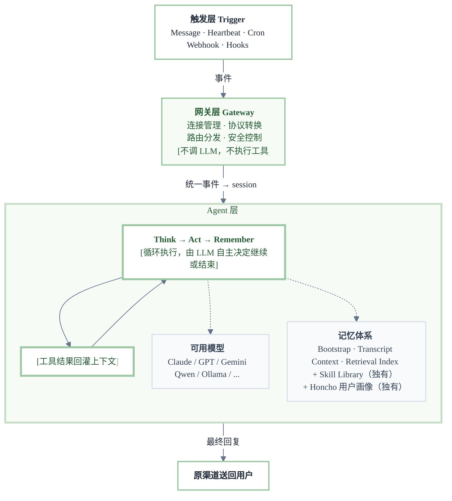
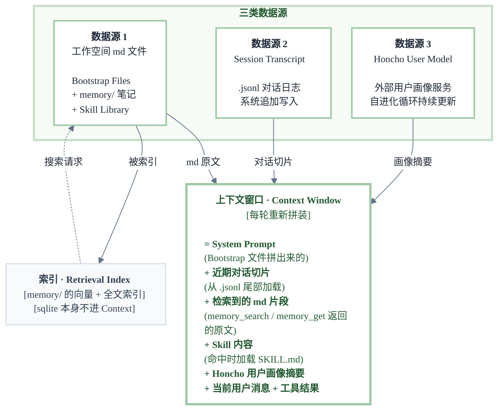
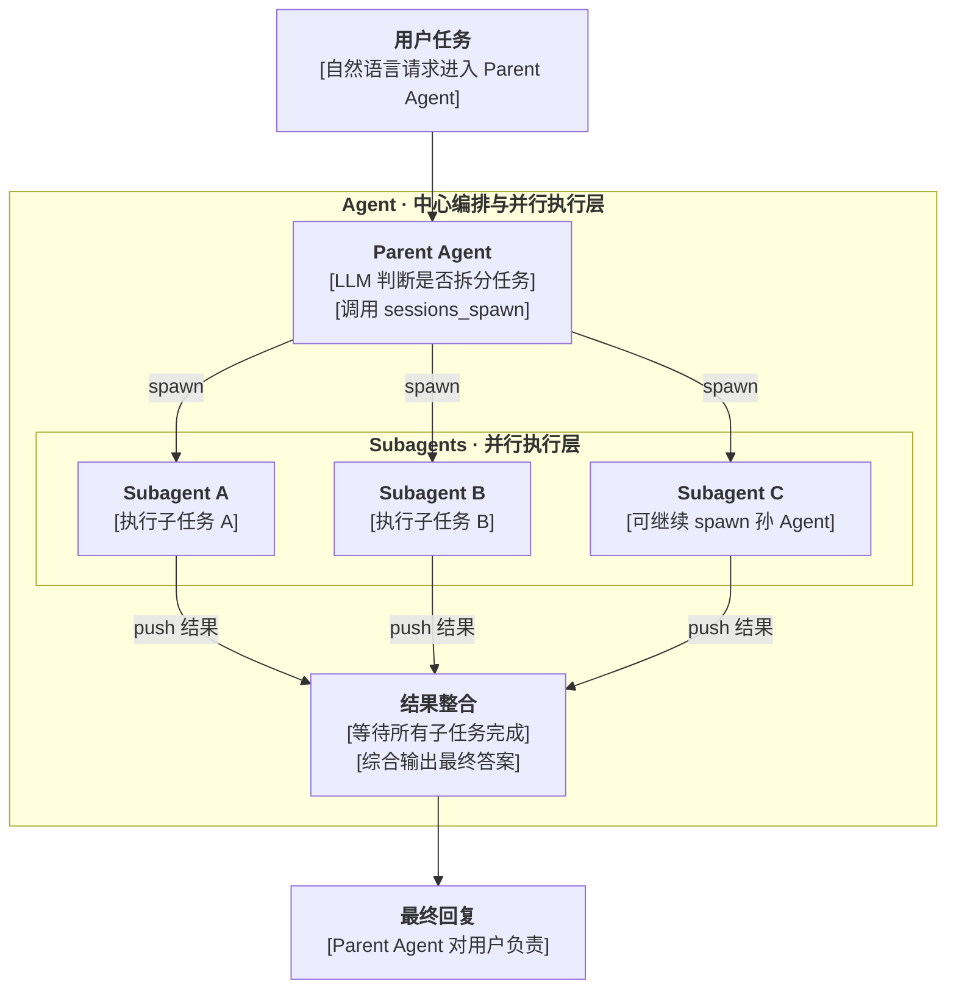
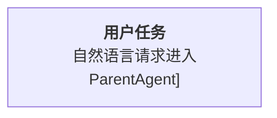
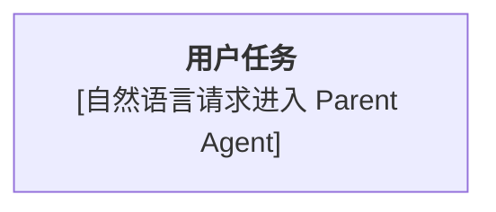

# VectorPeak Mermaid Reference

## Visual Rules

- Match VectorPeak light-mode docs: white page, restrained green accents, clear text, minimal decoration
- Use the Obsidian-friendly `theme: "base"` compact init by default so diagrams fit without horizontal dragging
- Use green borders for structure and pale-green fills for grouped domains
- Green is the dominant color, but same-level groups may use pastel blue, pastel purple, and pastel yellow to make parallel concepts easier to distinguish
- Emphasize the core execution layer with stronger border width, not heavy dark fills
- Keep helper nodes quieter with `#F8FAFC` fill and soft green border
- Avoid dark terminal-style blocks unless the user explicitly requests dark mode
- Avoid too many colors; use sage green as the brand signal, pastel colors only for meaningful same-level grouping, and soft slate for lines and readable text

## Base Theme

Use this compact `init` block for most diagrams:

```mermaid
%%{init: {
  "theme": "base",
  "flowchart": {
    "curve": "basis",
    "htmlLabels": true,
    "nodeSpacing": 28,
    "rankSpacing": 40,
    "padding": 12
  },
  "themeVariables": {
    "background": "#FFFFFF",
    "mainBkg": "#FFFFFF",
    "primaryColor": "#FFFFFF",
    "primaryTextColor": "#1F2937",
    "primaryBorderColor": "#9CC7A3",
    "lineColor": "#64748B",
    "clusterBkg": "#F7FBF6",
    "clusterBorder": "#C8DEC8",
    "fontFamily": "Inter, ui-sans-serif, system-ui",
    "fontSize": "13px"
  }
}}%%
```

## Reusable Classes

Append these classes after graph edges. Keep green as the main style; use blue, purple, and yellow only for same-level or parallel groups that need visual separation:

```mermaid
classDef primary fill:#FFFFFF,stroke:#9CC7A3,stroke-width:2px,color:#1F2937;
classDef green fill:#F7FBF6,stroke:#9CC7A3,stroke-width:2px,color:#245A32;
classDef blue fill:#F3F8FF,stroke:#B8D4F8,stroke-width:2px,color:#1E3A5F;
classDef purple fill:#FAF7FF,stroke:#D7C3F7,stroke-width:2px,color:#4C1D95;
classDef yellow fill:#FFF9E8,stroke:#E8D28A,stroke-width:2px,color:#6B4E16;
classDef neutral fill:#F8FAFC,stroke:#D8DEE8,stroke-width:1.5px,color:#334155;
classDef output fill:#FFFFFF,stroke:#9CC7A3,stroke-width:2px,color:#1F2937;
```

Use `style AgentLayer fill:#F7FBF6,stroke:#C8DEC8,stroke-width:3px,color:#245A32` for the most important container

## Few-Shot: Standard Output

Prefer this normalized style:



## Few-Shot Notes

- Good: `<b>触发层 Trigger</b>` inside node labels
- Good: `[不调 LLM，不执行工具]` when the user wants compact inline emphasis
- Good: manual line breaks such as `连接管理 · 协议转换<br/>路由分发 · 安全控制`
- Good: keep node titles centered, then left-align dense list bodies with `<div style='text-align:left'>...</div>`
- Good: bold the main list items, then put explanatory detail on the next line in parentheses
- Avoid: `subgraph AgentLayer["**Agent 层**"]`; use `subgraph AgentLayer["Agent 层"]`
- Avoid: overly long single-line labels; split with `<br/>`

## Few-Shot: Dense Node With Left-Aligned Body

Use this pattern when a single node contains a title plus many parallel components. Keep the title centered, then left-align the dense body so the reader can scan the list vertically:



## Few-Shot: Bracketed Layer Labels

Use this pattern after finishing a Mermaid graph when each node has a title plus one or more explanatory layers. The title layer stays unwrapped. Every later text layer split by `<br/>` is wrapped in `[]`. Subgraph titles may be bold. Edge labels stay unwrapped.

Good:



Bad:



Corrected:



## Escaping

- Wrap labels in double quotes: `A["文本"]`
- Escape literal brackets in labels only when Mermaid parsing fails:
  - `[` -> `&#91;`
  - `]` -> `&#93;`
- Parentheses are usually safe inside quoted labels; if Mintlify/Mermaid parsing fails, replace:
  - `(` -> `&#40;`
  - `)` -> `&#41;`
- Use `<br/>` for new lines inside node labels
- Avoid unquoted `A[文本(说明)]` when labels contain Chinese punctuation or parentheses
