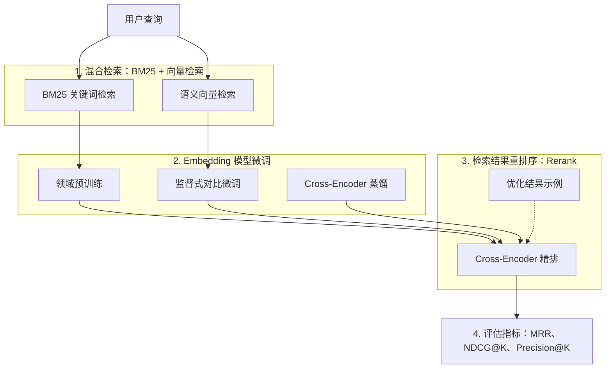

# Image To Markdown VP

## Purpose

Convert one or more user-provided images into a human-readable Markdown document while preserving the visible structure as faithfully as practical.

This skill is for image/screenshot-to-Markdown capture. It is not for rewriting, summarizing, polishing, or omitting details unless the user explicitly asks.

## Required Inputs

Before writing a file, the user must explicitly provide:

- Output directory path
- Output Markdown filename or an unambiguous Markdown basename. If the user gives a clear Markdown basename without `.md`, append `.md` automatically.
- One or more images or screenshots
- A generation signal, such as "生成", "为我生成一下", "图片给完了", "输出到文件", or equivalent

If the output directory or filename/basename is missing, ask for it before writing. Do not invent the destination.

## Multi-Batch Image Handling

The user may provide images across multiple messages.

- Treat newly provided images as part of the current capture set when the user says they are continuing the same document.
- Do not assume the image set is complete just because one message contains images.
- If the user says the content is not finished, such as "后续还有", "还没完", "前半部分", or equivalent, explicitly state in the final response that the Markdown is a partial document and can be continued later.
- Wait for an explicit generation signal before writing the Markdown file.
- Preserve image order by conversation order and attachment order. If order is ambiguous, ask before writing.
- If the user adds more images after a file has already been generated, update the same file only when they explicitly ask to continue that file.
- When a new batch starts or ends in the middle of a section, table, list, formula, or code block, preserve only the visible content and do not invent the missing continuation.

## Truncated or Incomplete Images

Before writing, inspect every image for visible incompleteness:

- Cropped text at the top, bottom, left, or right edge
- A heading followed by no body content
- A table, list, formula, or code block that starts or ends mid-item
- A screenshot that begins mid-section or ends with an unfinished sentence
- A multi-column screenshot where the next column/page continues a previous block

If any of these appear:

- Continue OCRing the readable visible content.
- Join cross-column or cross-image continuations only when the continuation is visually clear.
- Do not guess hidden or missing text; mark uncertain visible text with `[?]` only when needed.
- In the final response, explicitly name the affected image or position, for example: "第 2 张底部代码块被截断，已按可见内容整理，缺失部分需要补图。"
- If the user has said there will be more images, also say: "当前文档未完，后续图片发来后可继续追加。"

## Scoped Derived-Version Changes

When the user asks for a new Markdown version with numbering, heading, or formatting changes, treat it as a scoped transform, not a rewrite.

- Create a new versioned file by default, such as `_v2`, `_v3`, or the user-requested name. Overwrite only when explicitly requested.
- Change only the exact layer and pattern the user named. For example, if asked to change only top-level section headings from `## 1. ...` to `## 0x01. ...`, do not change `### 1.1 ...`, `#### 1. ...`, body ordered lists, tables, examples, or code blocks.
- Preserve the table of contents, directory, and navigation text unless the user explicitly names them as targets.
- Distinguish visually similar numbering forms before editing: `## 1.`, `### 1.1`, `#### 1.`, and body `1.` are different scopes.
- Keep all OCR content, formulas, images, and section order identical outside the requested transform.
- After writing, run a normalized diff against the baseline when practical. Normalize only the requested change back to the original form, then confirm the remaining diff is empty.
- Add regex checks for spillover, such as confirming `^#{3,6}\s+0x[0-9A-Fa-f]{2}\.` has zero matches when only `##` headings were supposed to change.

## Hard Requirements

These requirements are mandatory. Do not treat them as style preferences.

- MUST stop and ask if the output path or Markdown filename/basename is missing. If the basename is clear but `.md` is omitted, MUST append `.md` automatically and continue.
- MUST wait for an explicit generation or continuation signal before writing a file.
- MUST preserve image order by conversation order and attachment order unless the user corrects it.
- MUST inspect whether each image is truncated, incomplete, or a continuation before writing.
- MUST classify each visible region before OCR-only conversion: prose, code, table, formula, process diagram, architecture diagram, UI evidence, visual example, or ignorable page chrome.
- MUST convert process diagrams, architecture diagrams, RAG pipelines, layered relationship graphs, and decision flows into Mermaid as the primary representation.
- MUST preserve a diagram's structure as closely as Mermaid allows: orientation, numbered stages, subgraph grouping, parallel branches, side examples, arrows, and meaningful color cues.
- MUST include the Obsidian-friendly VectorPeak compact Mermaid init block in every Mermaid diagram unless the user explicitly asks for another theme or full-size rendering: use `theme: "base"`, `nodeSpacing: 24`, `rankSpacing: 34`, `padding: 10`, `fontSize: "13px"`, primary light-green border `#86C98A`, pale-green container `#F6FBF5`, and dark readable lines `#111827`.
- MUST scale every Mermaid diagram for direct reading in Obsidian/Mintlify without meaningful horizontal dragging. If the first draft is too wide, shorten labels, add `<br/>`, reduce spacing/font size, switch to stacked/two-column `TB`, or group phases before final output.
- MUST keep light green as the dominant Mermaid color, but may use pastel blue (`#DBEAFE` / `#93C5FD`), pastel purple (`#F3E8FF` / `#C4B5FD`), and pastel yellow (`#FEF3C7` / `#FCD34D`) to distinguish same-level or parallel modules.
- MUST NOT replace a required Mermaid diagram with only a cropped screenshot. Cropped/uploaded diagrams are allowed only as an "original diagram" reference after the Mermaid block.
- MUST NOT insert whole-page continuation screenshots with generic labels such as `续页截图 02`, `原始截图 03`, or `screenshot page 4`.
- MUST NOT keep screenshots that are mostly prose or code after the content has been transcribed; use Markdown text or fenced code instead.
- MUST confirm the output directory exists and is writable before writing. If it is missing or not writable, stop and ask for a valid destination.
- MUST use remote image URLs for Obsidian/PicList output. Local `assets/`, temp paths, and absolute local image paths are forbidden unless the user explicitly asks for an offline/local-assets copy.
- MUST validate uploaded image URLs before writing them. Default allowed host is `https://img.vectorpeak.cn/...`; any other CDN host requires explicit user approval.
- MUST sanitize secrets before writing or uploading: API keys, tokens, cookies, JWTs, private URLs, credentials, signed URLs, PicList/COS configuration values, and visible secrets inside screenshots.
- MUST make every few-shot example valid final Markdown source, not partially rendered output.
- MUST validate the written file before reporting completion.

## Workflow

### 1. Input Gate

1. Confirm the target directory and Markdown filename are explicit.
2. Confirm the user gave a generation signal such as "生成", "输出到文件", "继续补充", or equivalent.
3. Confirm the target directory exists and is writable. If not, stop and ask for a valid destination.
4. Confirm the filename is legal for the filesystem. If it has no extension and is an unambiguous Markdown basename, append `.md`; if it has a non-`.md` extension, stop and ask.
5. If appending to an existing document, read the file tail first and identify the exact continuation point.
6. Preserve attachment order. If the order is ambiguous, stop and ask.

### 2. Image Inspection Gate

For every image, record these decisions before writing:

- Is it truncated or a continuation?
- Which regions are prose/code/table/formula/diagram/UI evidence?
- Which regions should become Markdown text?
- Which regions must become Mermaid?
- Which regions should be cropped/uploaded as visual evidence?
- Which regions should be dropped because OCR already preserves them?

### 3. Diagram Gate

If a region is a process diagram, architecture diagram, RAG pipeline, layered graph, or decision flow:

1. Write a Mermaid block first.
2. Match the original layout as closely as Mermaid allows:
   - use `flowchart TB` for top-to-bottom diagrams and `flowchart LR` for left-to-right diagrams;
   - every Mermaid block MUST begin with the Obsidian-friendly VectorPeak compact `theme: "base"` init block: default `nodeSpacing: 24`, `rankSpacing: 34`, `padding: 10`, `fontSize: "13px"`, primary border `#86C98A`, cluster background `#F6FBF5`, cluster border `#B8DDB8`, and line color `#111827`;
   - use class definitions for `green`, `blue`, `purple`, `yellow`, and `neutral` when same-level modules need visual distinction, while keeping green as the dominant theme;
   - if a diagram is dense, reduce to `fontSize: "12px"`, `nodeSpacing: 20`, and `rankSpacing: 28` before changing semantics;
   - preserve the original diagram orientation when practical. For left-to-right pipelines in Obsidian, use compact `LR` Mermaid and shorten node labels while preserving meaning;
   - only switch a wide original `LR` diagram to `TB`, wrapped rows, or grouped phases when compact Mermaid still remains unreadable or the user explicitly prefers vertical layout;
   - use `subgraph` for boxed stages or modules;
   - use `direction LR` inside stages when the original has parallel boxes;
   - keep numbered stage labels such as `1. 混合检索` and `2. Embedding 模型微调`;
   - include side examples or before/after result boxes when they are meaningful;
   - add restrained `classDef` or `style` entries when colors carry structure.
3. Add a tight cropped original diagram after the Mermaid block only when visual comparison is useful.
4. Do not create Mermaid for plain command sequences, ordinary checklists, or linear installation steps.

### 4. OCR And Markdown Reconstruction

1. Reconstruct the visible hierarchy with `#`, `##`, `###`, and `####`.
2. Preserve original wording, examples, numbers, equations, labels, and section order.
3. Preserve emoji. If the exact emoji is unclear, use the closest reasonable emoji or `[emoji]`.
4. Convert code and commands to fenced blocks.
5. Convert simple rectangular tables to Markdown tables. For complex tables, use sectioned bullets.
6. Use LaTeX for formulas and avoid raw `|` in table cells.
7. Convert meaningful highlighting into Markdown emphasis only when the highlight changes meaning.

### 5. Image Crop And Upload Gate

1. Crop only meaningful visual evidence: diagrams, UI states, annotated result panels, product pages, charts, visual examples, terminal success/error proof.
2. Keep crops tight: include the evidence and necessary labels, exclude unrelated page chrome, prose columns, blank margins, and duplicated OCR text.
3. Prefer Obsidian Image Auto Upload Plugin -> PicList/PicGo local server -> COS/CDN.
4. When PicList is running, upload through `http://127.0.0.1:36677/upload` and write the returned remote URL.
5. If PicList cannot read a Chinese/non-ASCII path, copy the image to an ASCII-only temporary path and retry upload.
6. Validate every returned URL before writing it:
   - allow `https://img.vectorpeak.cn/...` by default;
   - allow a different `https://` CDN only when the user explicitly approved it;
   - reject `file:`, `data:`, `blob:`, localhost, private IPs, plain `http:`, and URLs containing signed credential parameters such as `token`, `signature`, `X-Amz`, `X-Cos`, `credential`, or `security-token`.
7. If upload still fails, continue with OCR/Mermaid only, report upload failure, and do not write local image links unless the user explicitly requests an offline/local-assets copy.
8. Temporary ASCII upload copies must never appear in Markdown and should be removed when practical.
9. Never expose PicList/COS credentials in Markdown, logs, or final responses.

### 6. Write Gate

1. Write only after the above gates are satisfied.
2. For derived versions, create a versioned file by default and preserve unrelated content exactly.
3. For continuation updates, remove obsolete "partial document" notices only when the new content completes that continuation.

### 7. Mandatory Validation Gate

Run validation before final response:

Validate in this order:

1. Target file exists.
2. Markdown fence count is even.
3. Mermaid fence count is paired and Mermaid is present when diagrams were present.
4. Markdown image syntax is complete and links are not broken by unescaped spaces, `)`, `<`, `>`, quotes, or invalid percent escapes.
5. No generic whole-page screenshot labels remain: `续页截图`, `原始截图`, `Original Screenshot`, `screenshot page`.
6. No forbidden local image paths remain unless explicitly requested: `assets/`, `../`, `.\`, `AppData`, `Temp`, `C:\`, `E:\`, `file://`.
7. PicList/Obsidian image output uses approved remote `https://` URLs, usually `https://img.vectorpeak.cn/...`.
8. No signed image URLs or credential-bearing query parameters remain: `token`, `sig`, `signature`, `expires`, `X-Amz`, `X-Cos`, `credential`, `security-token`.
9. No unresolved OCR markers remain unless intentionally reported: `[?]`, `TODO`.
10. No obvious secrets remain: `Authorization: Bearer`, `Cookie:`, `Set-Cookie:`, `eyJhbGciOi`, `api_key`, `secret`, `access_key`, `token=`, `password`, `AKIA`, `ghp_`, `github_pat_`, `sk-`.
11. No PicList/COS configuration values remain: `secretId`, `secretKey`, `bucket`, `endpoint`, `customUrl`.
12. Formula delimiters and `$$` counts are paired.
13. Markdown tables are not broken by raw unescaped `|`.

Use searches like these when practical:

```text
rg -n "续页截图|原始截图|Original Screenshot|screenshot page" <file.md>
rg -n "assets/|AppData|Temp|file://|[A-Za-z]:\\\\" <file.md>
rg -n "Authorization: Bearer|Cookie:|Set-Cookie:|eyJhbGciOi|api[_-]?key|secret[_-]?key|access[_-]?key|token\\s*[=:]|password\\s*[=:]|AKIA|ghp_|github_pat_|sk-" <file.md>
rg -n "piclist|picgo|tcyun|secretId|secretKey|bucket|endpoint|customUrl" <file.md>
```

### 8. Final Response Gate

Report only after validation. Include:

- exact written file path;
- whether Mermaid conversion was used for diagrams;
- whether images were cropped/uploaded and which backend was used when known;
- whether local assets/temp paths were avoided;
- any truncation, OCR uncertainty, upload failure, or remaining partial-document status.

## Cropped Image Few-Shots

### Few-Shot 1: Diagram In A Long Screenshot

Source screenshot contains a title, paragraphs, and a central architecture diagram.

Do:

````markdown
混合检索通过 BM25 与向量检索并行召回候选片段，再经过重排和指标评估形成闭环。




````

Do not:

```markdown

```

### Few-Shot 2: Code Screenshot Already Transcribed

Source screenshot is a code block plus surrounding explanation. The code has been converted into fenced Markdown.

Do:

````markdown
```python
def calculate_mrr(gt, res):
    ...
```
````

Do not add the original code screenshot unless the user explicitly wants visual proof.

### Few-Shot 3: UI Evidence Or Annotated Result

Source screenshot contains a UI panel, red-box annotation, terminal success output, or a visual before/after example.

Do:

```markdown
点击保存后，PicList 返回远程 URL，并由 Obsidian 插件写回 Markdown。


```

Keep the cropped region tight: include the UI state and the visible success/error message, but avoid unrelated page chrome, long prose, and blank margins.

## Output Style

Prefer clean Markdown over decorative formatting.

Use:

- `#`, `##`, `###`, `####` for visible heading hierarchy
- Blockquotes for callout-like remarks
- Markdown tables for comparison tables
- Fenced code blocks only for code, commands, or literal text blocks
- LaTeX for mathematical formulas
- Cloud image links for visual evidence captured from screenshots
- Mermaid blocks for true flows, architectures, pipelines, loops, and relationship diagrams

Avoid:

- Removing emoji just because it is decorative
- Adding analysis not visible in the image
- Turning raw OCR into a rewritten article
- Creating extra README files or sidecar notes unless requested
- Adding timestamps unless they are visible in the image
- Replacing useful UI evidence with OCR text only
- Embedding secrets or local temporary image paths when a cloud upload was intended
- Creating Mermaid diagrams for plain command sequences or simple checklists

## Formula Rules

Use robust Markdown/LaTeX that renders well in common Markdown tools such as Obsidian, GitHub-style preview, and KaTeX-like renderers.

### Delimiters

- Use inline math for short symbols: `$k_1$`, `$b$`, `$IDF(t)$`
- Use display math for standalone equations:

```markdown
$$
IDF(t)=\log_{10}\left(\frac{N}{n(t)}\right)
$$
```

- Ensure every `$$` delimiter is paired.
- Put display math delimiters on their own lines.

### Safer Syntax

- In formulas, prefer `D_1`, `D_2`, `D_3` over `D1`, `D2`, `D3` when used as symbols.
- Avoid raw vertical bars for document length or absolute value because they can break Markdown tables or previews:
  - Use `\lvert D\rvert`
  - Use `\lvert D_1\rvert`
  - Use `\lVert x\rVert` for norms
- Avoid Chinese inside LaTeX when possible. Put Chinese explanation outside the formula, or use short English variable labels.
- For multi-line calculations, use `aligned`:

```markdown
$$
\begin{aligned}
Score(D_1,Q)
&=TermScore(\text{apple},D_1)+TermScore(\text{banana},D_1) \\
&\approx0.6935+0.4919=1.1854
\end{aligned}
$$
```

- In Markdown tables, avoid formulas containing `|`. Use `\lvert...\rvert` or move the formula outside the table.
- Escape literal underscores in normal text when they are not meant as Markdown emphasis.

### OCR Formula Policy

- Preserve the formula as shown when it is readable.
- If a formula is partially unreadable, mark only the uncertain part with `[?]` rather than guessing.
- If the source has an obvious arithmetic correction or note, preserve that note.
- Do not silently change formulas to a "better" version unless the user asks for correction; if correction is necessary for readability, add `注：...`.

## Tables

Use Markdown tables when:

- The table has a clear rectangular structure
- Cells are short enough to remain readable
- Formulas inside cells do not contain risky raw `|`

If the table is complex, prefer sectioned bullets:

```markdown
### 对比

- **理论基础**
  - TF-IDF：...
  - BM25：...
```

## Validation Notes

The `Mandatory Validation Gate` is authoritative. Do not replace it with a casual read-through.

Additional checks:

- Main title and major sections are present.
- Image order reflects the source image order.
- Cropped visual evidence appears beside the related step.
- Any visibly truncated/incomplete image has a corresponding note for the user.
- If the user said more images are coming, the final response explicitly says the document is still partial.
- For derived versions, no numbering, heading, TOC, directory, list, formula, or image changes occur outside the user-requested scope.
- For scoped heading renumbering, normalized diff against the baseline passes after reversing only the intended heading transform.

## Final Response

Keep the final response short. Include:

- The written file path
- Whether formulas and tables were checked
- Whether image regions were cropped/uploaded and which image-bed backend was used when known
- Any unresolved OCR uncertainty, if present
- Any image that was visibly truncated, incomplete, or only a continuation
- Whether the document is still partial when the user says more images will follow

Example:

```text
已生成到 .../RAG基础_02_TF-IDF&BM25.md。已检查公式分隔符和裸 |D|，没有发现明显渲染风险。
```
